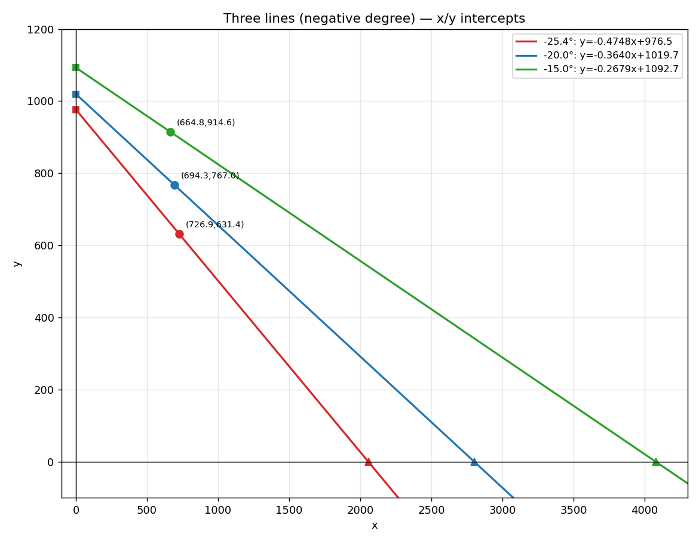

# Collider
Barrier vehicle collider simulator using machine learning methods. 

## LS-DYNA Data processing and Build dataset 
jump to [dataset](./dataset/README.md) for details.

## Training 
### Set Up Python Environment and install dependencies

[Official Conda Installation Link](https://docs.conda.io/projects/conda/en/latest/user-guide/install/index.html)
You may also need ```tmux``` to run the training in the background.

Ensure you have Python 3.11 installed (tested version). Create a new Conda environment:  
```bash
conda create --name collider --file environment.yml
conda activate collider

# Or run this.
pip install -r requirements.txt
```

```bash
rsync -avP --partial \
-e "ssh -i <your-ssh-key>" \
path_to_your_data \
path_to_your_remote_server
```

Build Apptainer image from definition file for HPC usage.  
```
apptainer build --fakeroot collider.sif collider.def
```


### Install PyTorch (Preferably with GPU & CUDA)  
Check your GPU and CUDA compatibility before installing. The following command installs PyTorch 2.5.0 with CUDA 11.8:  
```bash
pip install torch==2.5.0 torchvision==0.20.0 torchaudio==2.5.0 --index-url https://download.pytorch.org/whl/cu118
```
For different CUDA versions, refer to [PyTorch installation guide](https://pytorch.org/get-started/previous-versions/).

<!-- ### 3. Install PyTorch Geometric (PyG)  
Assuming PyTorch 2.5.0 with CUDA 11.8:  
```bash
pip install torch_geometric
pip install pyg_lib torch_scatter torch_sparse torch_cluster torch_spline_conv -f https://data.pyg.org/whl/torch-2.5.0+cu118.html
```
For other versions, refer to [PyG installation guide](https://pytorch-geometric.readthedocs.io/en/latest/install/installation.html). -->

### Prepare your dataset from DYNA-style files.

If you want to set dt as the minimum time unit, run this.
```bash
python dataset/d3plot_to_h5_dt.py \
    --src /home/kong/datasets/barrier/fem/T_lok_F_shape_barrier_9_3_100km \
    --tmp /home/kong/datasets/barrier/tmp \
    --out /home/kong/datasets/barrier/h5/T_lok_F_shape_barrier_9_3_100km_50_5_dt/output.h5 \
    --required-config configs/data/required_parts.config \
    --node-stride 50 \
    --frame-stride 5 \
    --frame-limit 100
```

If you want to use real time unit, run this.
```bash
python dataset/d3plot_to_h5.py \
    --src /home/kong/datasets/barrier/fem/T_lok_F_shape_barrier_9_3_100km \
    --tmp /home/kong/datasets/barrier/tmp \
    --out /home/kong/datasets/barrier/h5/T_lok_F_shape_barrier_9_3_100km_50_1_01/output.h5 \
    --required-config configs/data/required_parts.config \
    --node-stride 50 \
    --frame-stride 1 \
    --frame-limit 100
```

### Training
```
python train.py --experiment configs/experiments/exp_10.yaml --skip-git-check
```

### Barrier plate projection on xy plate 
 *Figure. Barrier middle plate projection on xy plate*

*Table. Barrier plate projection parameters*
| Degree | Slope m = tan(θ) | Line Equation | y-intercept (x=0) | x-intercept (y=0) |
|--------|------------------|----------------------------|-------------------|-------------------|
| −25.4° | −0.474835        | y = −0.474835x + 976.536   | 976.536           | 2056.579          |
| −20°   | −0.363970        | y = −0.363970x + 1019.672  | 1019.672          | 2801.525          |
| −15°   | −0.267949        | y = −0.267949x + 1092.698  | 1092.698          | 4078.004          |

weight part id: 2000353

### Evaluation and Rollout
After training, you can evaluate the model on the test set and perform rollouts.

```
python src/evaluate.py \
    --checkpoint outputs/checkpoints/exp_06/checkpoint-best.safetensors \
    --experiment configs/experiments/exp_06.yaml \
    --output-dir outputs/eval/exp_06
```

### Rollout 
```
python src/rollout.py \
        --checkpoint outputs/checkpoints/dg002/checkpoint-best.safetensors \
        --experiment configs/experiments/dg002.yaml \
        --raw-h5 /data/curtin_ciraee/curtin_xiangrui/data/h5dt_50ns_5fs_mat/T_lok_F_shape_barrier_9_3_80km/output.h5 \
        --mode both \
        --gif --gif-fps 10 \
        --gif-name dg002_80kph
```


### Uploading Model to Weights & Biases (W&B)
```
wandb artifact put \
    --name transolver_net \
    --type model \
    outputs/checkpoints/exp_collider_001/checkpoint-best.safetensors
```

# HPC user manual 

## Setup 

## environment 
install miniconda on head node, then test your script without GPU.
```bash
https://www.anaconda.com/docs/getting-started/miniconda/install/linux-install
```

You may activate conda by running the following command:
```bash
eval "$(/data/curtin_ciraee/curtin_xiangrui/ENTER/bin/conda shell.bash hook)" && conda activate collider
```

Creat a conda env in this specific path.
```bash
conda create -p /data/curtin_ciraee/curtin_xiangrui/env/conda/collider python=3.11
```

Install packages
```bash
pip install torch torchvision torchaudio --index-url https://download.pytorch.org/whl/cu121
pip install -r requirements.txt
```


# TODO

```bash
ssh -L 9999:curtin-jupyter.hpc.dug.com:443 dug
```

## tasks:
- [ ] scp 9 selected trajs to dug, including [60,80,100kph]x[0,400,800kg]=9 trajs
- [ ] conda env setup on dug 
- [ ] modify train.py for HPC, (use config to specify GPUs)
- [ ] submit job script to HPC (100 epochs for testing)
- [ ] rollout results, write reports
- [ ] submit whole job (500 epochs) to HPC

## notes:
- downsample should be done on laptop locally, then scp the downsampled trajs to dug, to save time on data transfer.
- conda env should be deplied on /data/.../curtin_xiangrui/env... according to the HPC user manual.
- use jupyterlab to link GPUs, and run train.py, use wandb to monitor the training process.
- use 1 A100 or two of them? need to dicuss 
- dug is available until the end of the month, need to finish the whole training process before then


## timeline: 
9-13, setup data, env;  
14-16 test run;   
17-21 500 epoch training;  
22-28 another training if needed;  
29-30 download results, save checkpoints.  

